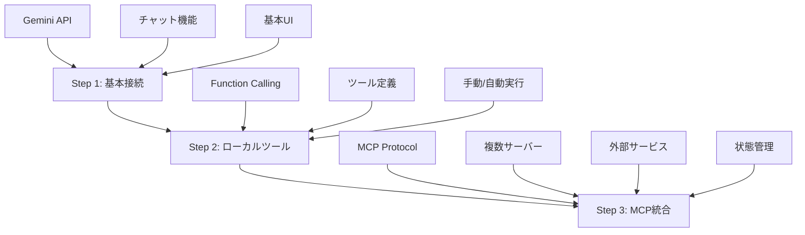

# Documentation

各ステップの詳細なファイル構成と役割について説明します。

## ドキュメント一覧

### [Step 1: Flutter x Gemini 基本接続](step1.md)
- **目的**: Gemini APIとの基本的な接続方法を学習
- **ファイル数**: 3ファイル
- **学習ポイント**: API認証、基本的なリクエスト/レスポンス処理

### [Step 2: Flutter x Gemini x ローカルツール](step2.md)
- **目的**: Function Callingの仕組みを理解
- **ファイル数**: 4ファイル
- **学習ポイント**: ツール定義、手動実行、AI自動選択

### [Step 3: Flutter x Gemini x MCP (完全版)](step3.md)
- **目的**: 実用的なMCPサーバー連携を実装
- **ファイル数**: 8ファイル
- **学習ポイント**: 複数サーバー管理、認証、エラーハンドリング

## 段階的学習の流れ

## 各ステップの複雑度

| ステップ | ファイル数 | 主要技術 | 難易度 |
|---------|----------|----------|--------|
| Step 1  | 3        | Gemini API | ⭐ |
| Step 2  | 4        | Function Calling | ⭐⭐ |
| Step 3  | 8        | MCP統合 | ⭐⭐⭐ |

## 推奨学習順序

1. **Step 1** を完全に理解してから Step 2 へ
2. **Step 2** でツールの概念を把握してから Step 3 へ  
3. **Step 3** で実用的な統合パターンを学習

各ステップのドキュメントには以下が含まれています：
- ファイル構成と役割
- 重要なコード例
- 学習ポイント
- 次のステップへの繋がり